# Agentic Video Editor Pipeline

## Architecture Overview

```mermaid
flowchart LR
  subgraph ingest [1 - Ingest]
    VideoIn["Video File"] --> Validate["Validate & Metadata"]
  end
  subgraph extract [2 - Extract]
    Validate --> AudioExtract["FFmpeg: Extract Audio"]
    Validate --> FrameSample["FFmpeg: Sample Keyframes"]
  end
  subgraph transcribe [3 - Transcribe]
    AudioExtract --> ChunkSplit["Split into N chunks"]
    ChunkSplit --> W1["Worker 1: faster-whisper"]
    ChunkSplit --> W2["Worker 2: faster-whisper"]
    ChunkSplit --> WN["Worker N: faster-whisper"]
    W1 --> Merge["Merge & Deduplicate"]
    W2 --> Merge
    WN --> Merge
  end
  subgraph analyze [4 - LLM Analysis]
    Merge --> LLMAbstraction["LLM Provider"]
    LLMAbstraction --> ClaudeCLI["Claude CLI"]
    LLMAbstraction --> AnthropicAPI["Anthropic API"]
    LLMAbstraction --> ReelMoments["Reel-Worthy Clips JSON"]
  end
  subgraph process [5 - Process Clips]
    ReelMoments --> ClipExtract["FFmpeg: Cut Segments"]
    ClipExtract --> Retranscribe["faster-whisper: Per-clip Re-transcribe (large model)"]
    ClipExtract --> YOLODetect["YOLO: Per-frame Person Detection"]
    ClipExtract --> Diarize["pyannote: Per-clip Diarization (skipped if 1 bbox)"]
    YOLODetect --> Timeline["Build Speaker Timeline"]
    Diarize --> Timeline
    Timeline --> SmartCrop["9:16 Crop driven by Timeline"]
    SmartCrop --> BurnSubs["Burn Subtitles"]
    Retranscribe --> BurnSubs
  end
  BurnSubs --> FinalReel["Output Reel"]
```




## Project Structure

```
agentic-video-editor/
  config/
    default.yaml              # All tunable settings
  src/
    __init__.py
    pipeline.py               # Orchestrator: chains all stages
    ingest.py                 # Validate video, extract metadata via ffprobe
    audio.py                  # Extract audio, split into chunks
    transcribe.py             # Parallel faster-whisper transcription
    analyze.py                # LLM-based reel moment detection
    detect.py                 # YOLO person detection per clip
    timeline.py               # Build speaker timeline [(start, end, bbox), ...] from bboxes (+ diarization post-MVP)
    diarize.py                # [POST-MVP] Per-clip pyannote diarization + mouth-motion face linking
    crop.py                   # 9:16 smart crop with smoothed panning, driven by timeline
    subtitles.py              # Generate .ass subtitles, burn with FFmpeg
    assemble.py               # Final reel assembly
    llm/
      __init__.py
      base.py                 # Abstract LLMProvider protocol
      claude_cli.py           # Invokes `claude` CLI as subprocess
      anthropic_api.py        # Uses anthropic Python SDK
  prompts/
    reel_detector.txt         # Carefully crafted system prompt
  main.py                     # CLI entry point (argparse)
  requirements.txt
  README.md
```

## Key Design Decisions

### 1. Transcription: Two-pass strategy

**First pass (whole video, for LLM analysis):**
- `faster-whisper` with CTranslate2 backend, runs on CPU or MPS (Apple Silicon optimized)
- Uses a fast/small model (`base` or `small`) -- accuracy only needs to be good enough for the LLM to understand context and identify interesting moments
- Audio split into overlapping chunks (default: 5min chunks, 10s overlap)
- Chunks transcribed in parallel (ThreadPoolExecutor with a shared model instance; CTranslate2 releases the GIL)
- Simple timestamp-based merge: when stitching chunk N+1 onto chunk N, drop any words from N+1 whose start timestamp falls within N's range. No fuzzy text alignment needed -- coarse accuracy is fine here.
- Output: a single transcript with `[MM:SS] text` formatting for the LLM

**Second pass (per selected clip, for subtitles):**
- After the LLM returns clip ranges and ffmpeg extracts each clip, re-transcribe the isolated clip with a high-quality model (`large-v3`)
- Single Whisper pass, no chunking -- clip is short (~15-60s), timestamps are inherently clean and clip-relative
- Word-level timestamps used directly for karaoke-style subtitle burning
- Eliminates all chunk-boundary dedup concerns from the subtitle path

**Multilingual:** model auto-detects language, or user can force `--language hi` / `--language en`. Both passes use the same language setting.

**Configurable:** both pass models are independently configurable via `config/default.yaml` (`transcribe.first_pass.model`, `transcribe.second_pass.model`).

### 2. LLM Abstraction Layer

- `LLMProvider` is a Python Protocol with a single method: `analyze(prompt: str, system: str) -> str`
- `ClaudeCLIProvider`: shells out to `claude -p "prompt" --output-format json`, parses stdout
- `AnthropicAPIProvider`: uses `anthropic` SDK with `messages.create()`
- Selected via config: `llm.provider: "claude_cli"` or `llm.provider: "anthropic_api"`
- Token optimization: only transcript text + sampled frame descriptions sent to LLM; response is structured JSON with clip timestamps and reasoning

### 3. Reel Detection Prompt Strategy (Minimal Tokens)

- Send transcript with timestamps in a compressed format: `[MM:SS] text`
- System prompt instructs the LLM to return JSON array of `{start, end, title, reason, hook_score}`
- No video frames sent in the first pass -- pure transcript analysis
- Optional second pass: send 1 sampled frame per candidate clip for visual validation (configurable, off by default)

### 4. Human Detection: YOLO v8 nano

- `ultralytics` package, `yolov8n.pt` model (6MB, fast enough for near-real-time on Apple Silicon MPS)
- **Detection frequency**: high — default every frame, configurable down to every Nth frame via `detect.sample_every_n_frames`. Since the crop stage already decodes every frame in OpenCV, running YOLO per-frame incurs only inference cost, no extra I/O.
- Filter detections for `person` class only; confidence threshold configurable
- **Primary speaker tracking**: when multiple people are detected, pick the one with the largest bbox area; maintain identity across frames via IoU continuity with the previous frame's chosen bbox (simple greedy matcher; no need for DeepSORT in v1)
- Output: per-frame `person_bbox` (or `None` if no detection) — consumed directly by the crop stage
- On frames with no detection, fall back to the smoothed x-center from previous frames (no jump)

### 5. Speaker Timeline Abstraction

- Central data structure shared between detection, (optional) diarization, and crop stages
- Shape: `list[Segment]` where each `Segment = (start: float, end: float, bbox_source: Callable[frame_idx -> bbox])`
- A `bbox_source` is typically a lookup into the per-frame YOLO output filtered to one persistent position
- Single-speaker clips produce a 1-entry timeline spanning the full duration
- Multi-speaker clips produce N entries, cutting between positions as the speaker changes
- Built by `timeline.py::build_speaker_timeline(per_frame_bboxes, diar_segments=None)`:
  - Cluster bbox x-centers across the clip → set of persistent positions
  - If `diar_segments is None` or only 1 persistent position → return single entry with largest/most-persistent bbox
  - Otherwise → link diarized speaker IDs to persistent positions via mouth-motion correlation, then emit one entry per diarization segment
- Apply minimum dwell time (default 0.8s) to merge flicker and avoid jittery cuts

### 6. Smart 9:16 Crop (OpenCV pipeline, timeline-driven)

- Source typically 16:9 (1920x1080) -> target 9:16 (1080x1920)
- Crop window width = `source_height * 9/16` (e.g. 608px for 1080p source), centered on the current segment's target bbox
- **Implementation**: decode the clip frame-by-frame with `cv2.VideoCapture`; for each frame look up the active timeline segment for that timestamp, fetch the bbox for that frame, slice the crop window as a numpy array, resize to 1080x1920, and pipe raw BGR frames into an `ffmpeg` subprocess for H.264 encoding. No dynamic FFmpeg filtergraph required.
- **Within a segment**: exponential moving average on crop-center x (`alpha` configurable, default ~0.1) to smooth bbox jitter
- **Between segments**: hard cut (reset EMA). Matches how human-edited dialog reels feel; avoids weird slow pans across the frame when speakers change.
- **Edge clamping**: `np.clip(x_center - width/2, 0, source_width - crop_width)` — crop window never leaves the frame
- **Fallback**: on frames with no detection inside a segment, hold the last smoothed x-center
- **Debug mode** (`--debug-crop`): render an auxiliary video with the YOLO bbox, crop rectangle, and current timeline segment ID drawn on top of the source frame, so smoothing + cut parameters can be tuned visually
- Why OpenCV over FFmpeg expression/sendcmd filters: trivially debuggable (print values, breakpoint, visualize), straightforward Python control flow for smoothing/clamping/fallback/segment-switch logic, negligible perf cost for short reels

### 7. Speaker Diarization (Post-MVP, Per-Clip)

- Only runs on clips where `timeline.py` detects >1 persistent bbox position — single-speaker clips skip it entirely (zero cost)
- Uses `pyannote.audio` (`pyannote/speaker-diarization-3.1`, gated HF model; requires `HF_TOKEN` env var)
- Runs on the short clip audio (~15-60s), not the whole video. CPU inference ~1-2s per clip; GPU near-instant.
- **Face linking**: during the first diarization segment for each speaker ID, measure mouth-opening variance per persistent bbox using MediaPipe face landmarks. Highest-variance bbox during that speaker's window = that speaker's position. Lock in the mapping once per clip.
- **Concurrency**: per-clip diarization runs alongside the per-clip second-pass Whisper call via `ThreadPoolExecutor(max_workers=2)` — both are small, independent operations on the same audio.
- **Graceful degradation ladder** inside `build_speaker_timeline`:
  1. No persons detected → crop to frame center
  2. Persons detected but no speech → static crop on largest bbox
  3. Speech detected but 1 speaker → single-entry timeline on the bbox with highest mouth activity
  4. Multiple speakers → full linking + multi-segment timeline
- MVP ships with a stub producing only case (1)-(3) behavior using bbox info alone; enabling diarization is a drop-in later since the timeline contract is unchanged.

### 8. Subtitle Burning

- Subtitles derived from the **second-pass per-clip transcription** (clean, accurate, clip-relative word timestamps)
- Extract clip with a small buffer (~2s) on each side; let subtitle timing drive the final trim if needed
- Word-level timestamps -> `.ass` subtitle file
- Styled with bold white text, dark outline, positioned at bottom-third of 9:16 frame
- Karaoke-style word highlighting (current word in accent color)
- Burned in via `ffmpeg -vf "ass=subtitles.ass"`

## Dependencies

```
faster-whisper>=1.1.0
ultralytics>=8.3.0
opencv-python>=4.10
numpy>=1.26
anthropic>=0.42.0
pyyaml>=6.0
rich>=13.0

# Post-MVP (multi-speaker diarization):
# pyannote.audio>=3.1      # gated HF model; requires HF_TOKEN
# mediapipe>=0.10          # face landmarks for mouth-motion linking
# torch                    # pulled in by pyannote
```

Plus system: `ffmpeg`, `ffprobe` (already installed)

## Pipeline Flow (main.py)

```python
# Pseudocode
config = load_config("config/default.yaml")
video = ingest(input_path)                                     # validate, get metadata
audio_path = extract_audio(video)                              # ffmpeg
transcript = transcribe_first_pass(audio_path, config)         # fast model, parallel chunks
clips = analyze_for_reels(transcript, llm_provider)            # LLM -> JSON clips
for clip in clips:
    segment = extract_segment(video, clip.start, clip.end, pad=2.0)    # ffmpeg + buffer
    per_frame_bboxes = detect_humans_per_frame(segment, config)        # YOLO, every frame

    # Second-pass transcription and diarization are independent — run concurrently
    with ThreadPoolExecutor(max_workers=2) as ex:
        f_words = ex.submit(transcribe_second_pass, segment, config)
        f_diar  = ex.submit(maybe_diarize, segment, per_frame_bboxes, config)   # post-MVP; stub returns None
        clip_words    = f_words.result()
        diar_segments = f_diar.result()                                # may be None

    timeline = build_speaker_timeline(per_frame_bboxes, diar_segments, segment.duration)
    cropped  = smart_crop_916_opencv(segment, timeline)                # cv2 slice + ffmpeg encode
    final    = burn_subtitles(cropped, clip_words)                     # ffmpeg + .ass
    save(final, output_dir)
```

