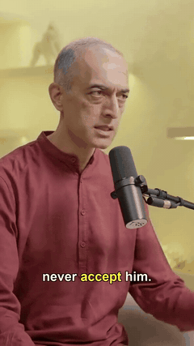
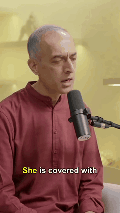

# PodClipper

Turn a long-form podcast, talk or interview into vertical 9:16 reels — locally, on your machine. Whisper transcribes, Claude picks the reel-worthy moments, YOLO + MediaPipe lock on the active speaker, OpenCV crops with smooth pans across shot cuts, and karaoke captions burn in.

🔗 **Live demo:** [podclipper.loukik.dev](https://podclipper.loukik.dev)

## Demo reels

Three reels generated end-to-end from a single ~60-minute podcast episode. Previews loop silently below — **click any tile to open the full MP4 with audio.**

<table>
  <tr>
    <td align="center" width="33%">
      <a href="https://github.com/LoukikNaik/PodClipper/releases/download/demo-assets-v1/reel_01_confidence-is-an-output-not-input.mp4">
        
      </a>
      <br/><em>"Confidence Is an Output, Not Input"</em>
      <br/><sub><a href="https://github.com/LoukikNaik/PodClipper/releases/download/demo-assets-v1/reel_01_confidence-is-an-output-not-input.mp4">▶ play with audio</a></sub>
    </td>
    <td align="center" width="33%">
      <a href="https://github.com/LoukikNaik/PodClipper/releases/download/demo-assets-v1/reel_02_make-anxiety-sit-in-the-back-seat.mp4">
        
      </a>
      <br/><em>"Make Anxiety Sit in the Back Seat"</em>
      <br/><sub><a href="https://github.com/LoukikNaik/PodClipper/releases/download/demo-assets-v1/reel_02_make-anxiety-sit-in-the-back-seat.mp4">▶ play with audio</a></sub>
    </td>
    <td align="center" width="33%">
      <a href="https://github.com/LoukikNaik/PodClipper/releases/download/demo-assets-v1/reel_03_how-hanuman-knew-it-was-sita.mp4">
        
      </a>
      <br/><em>"How Hanuman Knew It Was Sita"</em>
      <br/><sub><a href="https://github.com/LoukikNaik/PodClipper/releases/download/demo-assets-v1/reel_03_how-hanuman-knew-it-was-sita.mp4">▶ play with audio</a></sub>
    </td>
  </tr>
</table>

For full-screen playback with audio inline, visit the [live demo site](https://podclipper.loukik.dev).

## Pipeline

```
Video
  ↓ ingest        ffprobe — validate, metadata
  ↓ audio         ffmpeg — extract mono 16kHz WAV
  ↓ transcribe    mlx-whisper (default) — per-clip language auto-detect
  ↓ analyze       LLM — pick reel-worthy clips as JSON
  ↓ per clip:
       ├─ extract       ffmpeg cut ±2s pad
       ├─ detect        YOLOv8 + MediaPipe — all persons + face flags
       ├─ transcribe 2  mlx-whisper large-v3 — clean word timestamps
       │                (VAD + garble-retry; cached to words.json)
       ├─ shot-classify per-frame single vs two-shot (≥2 real people)
       ├─ crop          shot-aware 9:16:
       │                  single  → follow-the-speaker
       │                  stacked → two 9:8 panels, one person each
       │                  --comedy → single performer only (no split),
       │                             brightness+geometry rejects audience
       │                  optional --intro-zoom punch-in → pull-out opener
       ├─ subtitles     karaoke (classic) or 1–2-word pop overlay
       ├─ music         optional --music — LLM-scored ducked bed from library
       └─ evaluate      LLM-as-judge — publish / review / skip + scorecard
  ↓ outputs/<timestamp>/reel_NN_<title>.mp4
```

## Setup

Requires Python `>=3.10,<3.13` (mediapipe wheel constraint) and `ffmpeg` + `ffprobe` on PATH.

```bash
python3 -m venv .venv
source .venv/bin/activate
pip install podclipper                  # from PyPI (once published)
# — or, for local development —
pip install -e .                        # editable install from a clone
```

This installs the `podclipper` console command and pulls in every runtime dep (whisper, ultralytics, mediapipe, opencv, litellm, ...).

### LLM provider

Pick one via `config/default.yaml` or `--llm-provider`:

- **Claude CLI** (default) — install Claude Code so the `claude` binary is on PATH. No API key needed.
- **LiteLLM gateway** — routes to any vendor (Anthropic / OpenAI / Gemini / Groq / Ollama / ...) or any OpenAI-compatible proxy (TokenRouter / OpenRouter / vLLM / ...) via a single `model: <vendor>/<model>` string. Set the matching API key in `.env`.

Example `config/default.yaml` LiteLLM block:

```yaml
llm:
  provider: litellm
  model: anthropic/claude-sonnet-4-5      # or openai/gpt-5-mini, ollama/llama3, etc.
  litellm:
    api_base: null                        # set for gateways: https://api.tokenrouter.com/v1
    api_key_env: null                     # null → litellm picks by model prefix
                                          # (anthropic/ → ANTHROPIC_API_KEY, openai/ → OPENAI_API_KEY)
    timeout_seconds: 900
    num_retries: 2
```

### Optional: speaker diarization

For single-camera interview footage where the editor didn't cut between speakers, enable pyannote-driven follow-the-speaker:

```bash
pip install 'podclipper[diarize]'        # adds pyannote.audio + torch (~5 GB)
```

1. Accept terms at [huggingface.co/pyannote/speaker-diarization-3.1](https://huggingface.co/pyannote/speaker-diarization-3.1).
2. Add `HF_TOKEN=hf_xxx` to a `.env` file in your working directory (see `.env.example`).
3. Set `crop.mode: single` AND `diarize.enabled: true` in your config.

The pipeline runs without it — it just won't follow speaker turns visually in single-cam edits.

### Models

- `yolov8n.pt` (6 MB) — auto-downloaded by ultralytics on first run.
- MediaPipe face detector + landmarker — auto-downloaded to `.cache/`.
- Whisper models (`base`, `large-v3`) — auto-downloaded from HuggingFace.

### Transcription engine

The default is **mlx-whisper** (Apple-Silicon GPU — best quality and speed).
It's installed automatically only on Apple Silicon (platform-marked dependency).

**Not on an Apple-Silicon Mac?** No action needed — if mlx-whisper isn't
installed/importable, PodClipper automatically falls back to **faster-whisper**
(CPU/CUDA). To force it explicitly (or silence the fallback warning):

```bash
podclipper video.mp4 --whisper-engine faster
# or set  transcribe.engine: faster  in an override config
```

faster-whisper's default compute type is `int8` on CPU (works out of the box);
for CUDA set `float16` / `int8_float16` in config.

## Usage

```bash
podclipper path/to/video.mp4
# equivalent (no install needed if you just cloned the repo):
python -m podclipper path/to/video.mp4
```

Common flags:

```bash
podclipper video.mp4 \
  --llm-provider litellm \
  -c my-overrides.yaml \
  --output-dir outputs/my-reels \
  --language en \
  --max-clips 5 \
  --debug-detect \
  --debug-crop \
  -v
```

Feature flags:

```bash
# Comedy / single-performer footage: never split into stacked panels, lock the
# crop on the (lit) performer and ignore the (shadowed) audience.
podclipper standup.mp4 --comedy

# Background music: an LLM scores every library section (0–10) for the reel's
# vibe and lays the best-matching ducked bed under the speech.
podclipper video.mp4 --music

# Dopamine-hook opener + TikTok-style pop captions
podclipper video.mp4 --intro-zoom --subtitle-style pop
```

Run `podclipper --help` for the full list.

By default (no `-c`), the packaged `default.yaml` is used. Pass `-c your-overrides.yaml` to point at a custom config file (it must be the full config, not a partial override).

Outputs land in `outputs/<timestamp>/reel_NN_<slugified-title>.mp4` alongside a `.txt` sidecar with the LLM's reasoning, source timestamps, and the LLM-judge scorecard.

### Iterating on crop changes only

If you've already run the full pipeline and just want to re-render reels with updated detect / timeline / crop logic (without re-running Whisper or the LLM):

```bash
python dev/regen_crops.py .cache/<video_stem>-<hash> outputs/regen_run sidecar_dir/
```

This reuses cached `segment.mp4` and `words.json` and only re-runs detect + timeline + crop + subtitle burn. (Lives under `dev/` because it's a development tool, not part of the installed package.)

## Configuration

The packaged `default.yaml` ships with sensible defaults. To customize, copy it out and pass with `-c`:

```bash
podclipper --help                                # confirms install
python -c "from podclipper.config import load_default_config, ns_to_dict; \
           import yaml; \
           print(yaml.safe_dump(ns_to_dict(load_default_config())))" > my-overrides.yaml
# edit my-overrides.yaml, then
podclipper video.mp4 -c my-overrides.yaml
```

Useful knobs:

- `transcribe.first_pass.model` / `second_pass.model` — Whisper model sizes
- `analyze.min/max_clip_seconds`, `target_clips` — clip length and count hints to the LLM
- `detect.sample_every_n_frames` — bump for speed, drop to 1 for smoothest tracking
- `detect.face_aware` — face-attribution gate that prefers front-facing speakers
- `crop.smoothing_alpha` — lower = smoother panning
- `crop.min_segment_dwell_seconds` — min time between hard cuts
- `diarize.enabled` — multi-speaker follow-the-speaker (needs `HF_TOKEN`)
- `evaluate.publish_threshold` / `skip_threshold` — LLM-judge gating
- `subtitles.font_size`, `margin_v`, `primary_color`, `highlight_color` — styling

## Caching + resume

Intermediate artifacts persist under `.cache/<video_stem>-<hash>/`:

```
.cache/mytalk-a2340ae50a/
  audio.wav                    # whole-video extracted audio
  reel_01_i-quit-my-job/
    segment.mp4                # extracted clip + pad
    words.json                 # cached 2nd-pass Whisper words
    cropped.mp4                # after 9:16 smart crop
```

Re-running reuses these — fast iteration on subtitles, prompt or crop. Pass `--no-cache` to force a rebuild.

## Project layout

```
pyproject.toml                  # PEP 621 metadata, deps, console entry point
src/podclipper/                 # the installable package
  __init__.py    __main__.py    # `python -m podclipper`
  main.py                       # CLI entry point (`podclipper = "podclipper.main:main"`)
  config/
    __init__.py                 # load_config + load_default_config (importlib.resources)
    default.yaml                # bundled defaults — used when no -c is passed
  prompts/
    __init__.py                 # load_prompt(name)
    reel_detector.txt           reel_refiner.txt
    trailer_picks.txt           trailer_refiner.txt           trailer_evaluator.txt
  llm/
    base.py                     # LLMProvider Protocol + LLMError
    claude_cli.py               # subprocess to `claude -p`
    litellm_provider.py         # unified gateway: Anthropic / OpenAI / Gemini / ...
  ingest.py    audio.py         transcribe.py     transcribe_cleanup.py
  analyze.py   trailer.py
  detect.py    timeline.py      crop.py           diarize.py
  subtitles.py evaluate.py      pipeline.py
  logging_util.py  types.py

dev/                            # dev/debug scripts (NOT installed)
  regen_crops.py  debug_detect_clip.py  diag_frame.py  post_via_instagrapi.py

tests/unit/                     # 192 characterization tests

landing/                        # Vite + React landing page (ships separately)
.github/workflows/
  publish-pypi.yml              # tag-triggered PyPI release via Trusted Publisher
  deploy-landing.yml            # GH Pages deploy for landing/
docs/demos/                     # README GIFs
```

## Deployment

The landing page deploys to **podclipper.loukik.dev** via GitHub Pages on every push to `main` that touches `landing/**`. See [`.github/workflows/deploy-landing.yml`](.github/workflows/deploy-landing.yml).

## Known limitations

- **No vision in LLM analysis** — reel selection is transcript-only today. Purely visual moments (gestures, reactions) may be missed.
- **No resumability within a stage** — caching is between stages, not inside a long Whisper run. Fine for sources under ~1 hour.
- **Homebrew ffmpeg on macOS often lacks libass** — subtitles render in Python (PIL + OpenCV) instead of via the `ass` filter, so this isn't a blocker. Tradeoff: slower than filter-based rendering.

## License

MIT — see [LICENSE](LICENSE) if present, otherwise treat as MIT.
